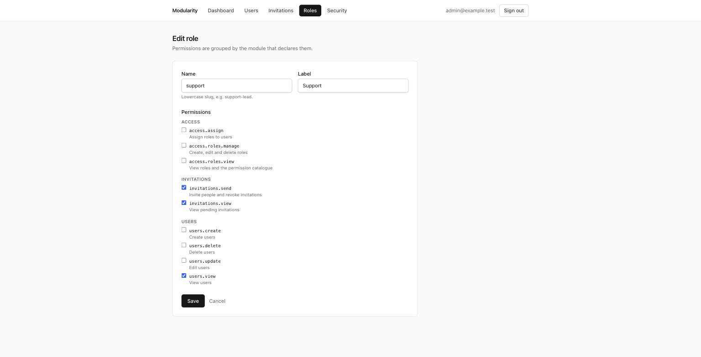

# Modularity

[](https://github.com/stkuzma/modularity/actions/workflows/ci.yml)

A modular monolith on Laravel 13 and PHP 8.5.

## Why I built this

I have spent most of my time in Laravel codebases that were still monoliths
and were meant to be modular, where the boundaries lived in a README and in
whatever the team remembered. They hold for a while and then they do not, and
nothing tells you when they stopped.

So I wanted to find out how much of a boundary can actually be enforced inside
one application, without splitting it into services and without burying it
under abstractions. This is the result. It is opinionated, some of it would be
too expensive for a small application, and the parts I am least sure about are
written down in [`docs/decisions`](docs/decisions).

## The rules, and how they are enforced

`tests/Feature/Core/ArchitectureTest.php` fails the build when:

- anything in `app/Core` references a module,
- a processor imports `Illuminate\Http`,
- a module's production code reaches into another module outside its
  `Contracts`, `Data`, `Enums` or `Events`,
- a module imports another module's `*Repository` contract, because a module
  offers capabilities and not the shape of its storage,
- a module queries a table another module's migration created,
- a module binds a contract it does not own,
- module dependencies form a cycle,
- `config/modules.php` and `app/Modules` disagree about which modules exist.

I wrote those rules and then attacked them: four of the first exploits went
straight through, including one where a bad regex meant the rule could never
match anything. What was found, what was fixed and what is still not caught is
in [Attacking the boundaries](docs/ARCHITECTURE.md#7a-attacking-the-boundaries).

Documentation drifts. A failing test does not.

```
                    ┌────────────────────────────────┐
                    │              Core              │
                    │   Module   Pipeline   Http     │
                    │   Access   Auth       Audit    │
                    │   Navigation          Health   │
                    │                                │
                    │  contracts and infrastructure, │
                    │  never business policy         │
                    └───────────────┬────────────────┘
                                    │
        ┌───────────────┬───────────┴───┬───────────────┐
        │               │               │               │
      Users          Access           Auth        Invitations
        ▲               │               │               │
        └───────────────┴───────────────┴───────────────┘
              through Contracts / Data / Events only
```

`Users` is the base module: `Access`, `Auth` and `Invitations` hold foreign
keys into its table, so it cannot be removed. The others can, as long as
nothing declares a dependency on them.

## The proof

I did not want to claim this in prose, so it is a command.

```bash
composer test:without Access
```

It deletes `app/Modules/Access`, removes its line from `config/modules.php`,
runs the whole suite, and puts the module back.

```
without Access        OK (178 tests, 554 assertions)
without Auth          OK (157 tests, 473 assertions, 1 skipped)
without Invitations   OK (202 tests, 629 assertions)
```

The skip is deliberate: one `Invitations` test signs the new account in, and
sign-in belongs to `Auth`. It skips rather than fails, because a module's
tests must not require another module to be installed.

## The trade-off

This architecture pays complexity up front. Repositories, DTOs, presenters and
module providers add more files than a conventional Laravel application needs.

That cost buys explicit module boundaries, unit tests that need no database,
modules that can be removed, and rules CI enforces rather than a document
describing. **For a small CRUD application I would use Laravel's conventional
structure instead** — most of what is below would be overhead there.

Every choice is recorded in [`docs/decisions`](docs/decisions), with what it
costs and what was rejected.

## A five minute tour

| Look at | To see |
|---|---|
| `config/modules.php` and any `*ServiceProvider` | the whole extension mechanism |
| `app/Modules/Users/Processors/CreateUser.php` | a use case with no framework in it |
| `app/Modules/Users/Tests/Contracts/UserRepositoryContract.php` | why the test fakes can be trusted |
| `tests/Feature/Core/ArchitectureTest.php` | the rules, executable |
| `app/Modules/Auth/Services/Totp.php` | RFC 6238, checked against the RFC's own vectors |
| `deploy.sh` | a rollout, and why rollback is a traffic switch |



Permissions are grouped by the module that declares them. The catalogue comes
from code: `php artisan access:sync-permissions` projects what the modules
declare into storage, and no endpoint writes there.

## The same use case, API and screens

Every screen is a second delivery of something the JSON API already exposes.
The controller changes; the processor, the form request and the domain
exception do not.

```php
// Api/CreateUserController
$user = $this->processor->process($request->toData());
return $this->created($this->presenter->present($user));

// Web/CreateUserFormController
$user = $this->processor->process($request->toData());
return redirect()->route('users.index')->with('status', "...");
```

One renderer in `bootstrap/app.php` decides how a failure arrives: the error
envelope for a JSON caller, a redirect carrying the message for a browser.

## Two questions the core asks

A feature module asks two things about whoever is calling it. The core states
both and a module answers them. The defaults disagree with each other, and
[ADR 006](docs/decisions/006-failure-directions.md) explains why.

| Question | Contract | Core default | Answered by |
|---|---|---|---|
| May this actor do this? | `AccessChecker` | `DeniesEverything` | `Access` |
| May this account sign in at all? | `SignInGuard` | `AllowsAnyAccount` | `Users` |

## Running it

```bash
composer install
npm install && npm run build
cp .env.example .env
php artisan key:generate
php artisan migrate --seed   # prints the sign-in details
composer check               # style, static analysis, tests
php artisan serve            # admin@example.test / password
```

PHP 8.5 is required. If yours is older:

```bash
docker run --rm -v "$PWD":/app -w /app php:8.5-cli php vendor/bin/phpunit
```

## Quality gates

The same commands run locally, in the pre-push hook and in CI.

| Command | Gate |
|---|---|
| `composer lint` | Pint, Laravel preset with strict types |
| `composer analyse` | PHPStan level 9 with Larastan |
| `composer test` | PHPUnit, 213 tests |
| `composer test:coverage` | coverage floor, fails under 90 percent |
| `composer test:without <Module>` | the suite with a module deleted |

Coverage is a guardrail, not evidence that behaviour is correct. The tests
worth reading are the boundary one, the repository contract one, and the one
that suspends a user and watches another module revoke their tokens.

## Deploying it

```bash
cp .env.example .env
docker compose up -d
docker compose exec app_blue php artisan key:generate
docker compose exec app_blue php artisan migrate --seed   # once, on a new volume
```

The containers report `unhealthy` until that migration runs, and
`GET /api/health` says which dependency is missing. After that:

```bash
./deploy.sh green --tag v2     # build, gate, switch traffic
./deploy.sh --status
./deploy.sh --rollback         # back in about a second
```

Two application containers behind an nginx proxy. The idle colour keeps
running the previous image, so a rollback is a config reload rather than a
rebuild. What this deliberately does not solve is listed in
[`docs/DEPLOYMENT.md`](docs/DEPLOYMENT.md).

## Documentation

| | |
|---|---|
| [`docs/decisions`](docs/decisions) | what was chosen, what it costs, what was rejected |
| [`docs/ARCHITECTURE.md`](docs/ARCHITECTURE.md) | how it actually works |
| [`docs/MODULES.md`](docs/MODULES.md) | adding one, written by following it |
| [`docs/DEPLOYMENT.md`](docs/DEPLOYMENT.md) | the rollout, and its limits |

## Licence

MIT. See [`LICENSE`](LICENSE).
