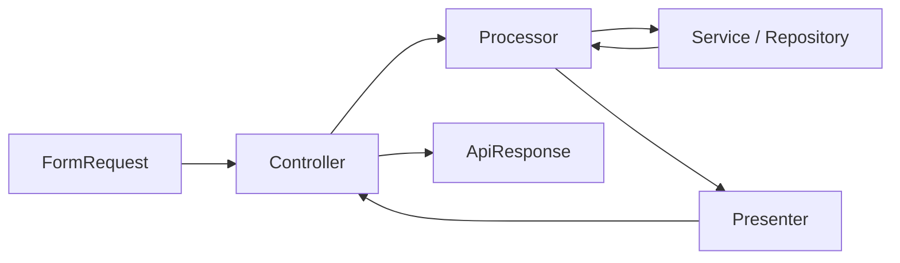
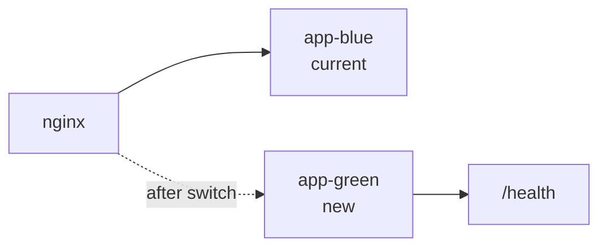

# Modularity: architecture

A reference implementation of a modular monolith on Laravel 13 and PHP 8.5.

The point of this repository is the structure, not the feature set. It shows how
to keep a single deployable application from turning into a mud ball: modules
own their code, their routes, their schema and their tests; the core owns the
contracts they plug into and nothing else.

---

## 1. Goals and non-goals

**Goals**

1. A new module can be added without editing a single file in `app/Core`.
2. A module that nothing depends on can be deleted by removing its directory
   and one config line, and the test suite still passes. Where a dependency
   does exist it is visible in the schema (a foreign key) rather than hidden
   in an import, and the boundary test says so.
3. Business logic is reachable and testable without HTTP.
4. Interfaces are introduced where they define a module boundary or provide a
   meaningful test seam, and nowhere else. Not every collaborator needs one.
5. The quality gates (style, static analysis, tests) are the same locally and in
   CI, and they are cheap enough to run on every commit.

**Non-goals**

1. Microservices. This is one deployable unit and one database, on purpose.
2. Event sourcing or CQRS. The write model is the read model here.
3. Full DDD ceremony. There are no aggregates or a domain event bus. The
   vocabulary is deliberately small: module, processor, presenter, repository.
4. A design system. The UI exists to prove the stack wires up end to end.

For an application of this size I prefer a modular monolith, because it gives
explicit boundaries without introducing network boundaries. If a module ever
does need to become a service, the interface it already sits behind is where
the split would happen.

---

## 2. Layout

```
app/
  Core/                        infrastructure and contracts, never business policy
    Http/
      ApiController.php
      WebController.php
      Middleware/
    Module/
      ModuleServiceProvider.php
      ModuleRegistry.php
    Pipeline/
      Processor.php
      Presenter.php
    Http/Responses/
      ApiResponse.php
    Exceptions/
      DomainException.php
      NotFoundException.php
      ForbiddenException.php
      ConflictException.php
      ValidationException.php
    Audit/
      AuditTrail.php
      Auditable.php
    Health/
      HealthCheck.php
      HealthReport.php
  Modules/
    Auth/                      authentication, sessions, tokens, MFA
    Access/                    roles, permissions, authorization
    Users/                     user lifecycle
  Providers/
config/
  modules.php                  the only place modules are switched on
docs/
  ARCHITECTURE.md              this file
  MODULES.md                   how to add one
  DEPLOYMENT.md                blue-green rollout
```

### Module anatomy

Every module is the same shape. Predictability is the feature.

```
app/Modules/Users/
  Contracts/
    UserRepository.php             interface, owned by the module
  Data/
    CreateUserData.php             readonly DTOs, no framework types
    UpdateUserData.php
  Enums/
    UserStatus.php
  Events/
    UserRegistered.php
  Exceptions/
    EmailAlreadyTaken.php
  Http/
    Controllers/Api/
      ListUsersController.php      one invokable class per endpoint
      CreateUserController.php
    Controllers/Web/
    Requests/
      CreateUserRequest.php
  Models/
    User.php                       Eloquent lives inside the module
  Presenters/
    UserPresenter.php
  Processors/
    CreateUser.php                 one use case per class
    ListUsers.php
  Providers/
    UsersServiceProvider.php
  Repositories/
    EloquentUserRepository.php
  Database/
    Migrations/
    Factories/
  Policies/
    UserPolicy.php
  routes/
    api.php
    web.php
  Tests/
    Unit/
    Feature/
```

Three conventions carry most of the weight:

- **Models live in the module, not in `app/Models`.** A central model folder is
  the first thing that re-couples modules to each other.
- **Migrations and factories live in the module.** Deleting the directory
  deletes the schema history with it, and the module is genuinely portable.
- **Tests live in the module.** A module you can read top to bottom in one
  directory is a module you can hand to someone else.

The one thing modules do not own is the shared `users` table identity: `Access`
and `Auth` both need a user. That dependency is expressed as an interface
(`Users\Contracts\UserRepository`) that the depending module type-hints, never
as a direct Eloquent reference across the boundary.

---

## 3. Module registration

`config/modules.php` is the single switchboard.

```php
<?php

declare(strict_types=1);

use App\Modules\Access\Providers\AccessServiceProvider;
use App\Modules\Auth\Providers\AuthServiceProvider;
use App\Modules\Users\Providers\UsersServiceProvider;

return [
    'enabled' => [
        AuthServiceProvider::class,
        AccessServiceProvider::class,
        UsersServiceProvider::class,
    ],
];
```

`ModuleRegistry` reads that list at boot and registers each provider. The base
provider discovers everything else by convention, so a module provider is
usually a list of bindings and nothing more.

```php
<?php

declare(strict_types=1);

namespace App\Core\Module;

use Illuminate\Support\Facades\Route;
use Illuminate\Support\ServiceProvider;
use ReflectionClass;

abstract class ModuleServiceProvider extends ServiceProvider
{
    /** Route middleware groups, overridable per module. */
    protected string $apiMiddleware = 'api';

    protected string $webMiddleware = 'web';

    /** Interface to implementation, merged into the container on register(). */
    abstract protected function bindings(): array;

    final public function register(): void
    {
        foreach ($this->bindings() as $abstract => $concrete) {
            $this->app->bind($abstract, $concrete);
        }

        $this->mergeConfig();
    }

    final public function boot(): void
    {
        $base = $this->modulePath();

        $this->loadMigrationsFrom($base.'/Database/Migrations');
        $this->loadRoutes($base);

        if (is_dir($base.'/Resources/views')) {
            $this->loadViewsFrom($base.'/Resources/views', $this->moduleName());
        }

        $this->registerPolicies();
    }

    protected function moduleName(): string
    {
        return class_basename(str_replace('ServiceProvider', '', static::class));
    }

    private function modulePath(): string
    {
        return dirname((new ReflectionClass(static::class))->getFileName(), 2);
    }

    private function loadRoutes(string $base): void
    {
        foreach (['api' => $this->apiMiddleware, 'web' => $this->webMiddleware] as $file => $middleware) {
            $path = "{$base}/routes/{$file}.php";

            if (! is_file($path)) {
                continue;
            }

            Route::middleware($middleware)
                ->prefix($file === 'api' ? 'api' : '')
                ->group($path);
        }
    }
}
```

A concrete provider then reads:

```php
final class UsersServiceProvider extends ModuleServiceProvider
{
    protected function bindings(): array
    {
        return [
            UserRepository::class => EloquentUserRepository::class,
        ];
    }
}
```

Why a provider per module instead of a flat array of module names plus a static
route loader: the provider is the natural Laravel extension point, it gives each
module a place to declare its own bindings without a god-provider, and testing a
module in isolation means registering one provider.

**Test that enforces it.** `Tests\Feature\Core\ModuleContractTest` walks
`config('modules.enabled')` and asserts that each provider extends the base
class, that its declared routes resolve, and that every interface it binds is
actually resolvable from the container. A module that breaks the contract fails
CI, not code review.

---

## 4. The request pipeline



Four responsibilities, four classes, no overlap.

| Stage | Knows about HTTP | Knows about the database | Responsibility |
|---|---|---|---|
| `FormRequest` | yes | no | Shape and authorize the input, produce a DTO |
| Controller | yes | no | Wire request to processor to presenter |
| Processor | no | through interfaces | The use case |
| Presenter | no | no | Shape the output |

The controller is deliberately boring. If a controller ever grows a conditional,
that conditional belongs in the processor.

```php
<?php

declare(strict_types=1);

namespace App\Modules\Users\Http\Controllers\Api;

use App\Core\Http\ApiController;
use App\Modules\Users\Http\Requests\CreateUserRequest;
use App\Modules\Users\Presenters\UserPresenter;
use App\Modules\Users\Processors\CreateUser;
use Illuminate\Http\JsonResponse;

final class CreateUserController extends ApiController
{
    public function __construct(
        private readonly CreateUser $processor,
        private readonly UserPresenter $presenter,
    ) {}

    public function __invoke(CreateUserRequest $request): JsonResponse
    {
        $user = $this->processor->process($request->toData());

        return $this->created($this->presenter->present($user));
    }
}
```

One invokable controller per endpoint. It keeps constructor injection honest:
a class that serves one route only injects what that route needs, and the route
file reads as a table of contents.

### Processor

```php
<?php

declare(strict_types=1);

namespace App\Core\Pipeline;

/**
 * A single use case. One entry point, no knowledge of HTTP or presentation.
 *
 * @template TInput
 * @template TOutput
 */
interface Processor
{
    /**
     * @param  TInput  $input
     * @return TOutput
     */
    public function process(mixed $input): mixed;
}
```

```php
<?php

declare(strict_types=1);

namespace App\Modules\Users\Processors;

use App\Core\Audit\AuditTrail;
use App\Core\Pipeline\Processor;
use App\Modules\Users\Contracts\UserRepository;
use App\Modules\Users\Data\CreateUserData;
use App\Modules\Users\Exceptions\EmailAlreadyTaken;
use App\Modules\Users\Models\User;
use Illuminate\Support\Facades\DB;

/** @implements Processor<CreateUserData, User> */
final readonly class CreateUser implements Processor
{
    public function __construct(
        private UserRepository $users,
        private AuditTrail $audit,
    ) {}

    public function process(mixed $input): User
    {
        if ($this->users->existsByEmail($input->email)) {
            throw EmailAlreadyTaken::for($input->email);
        }

        return DB::transaction(function () use ($input): User {
            $user = $this->users->create($input);

            $this->audit->record('user.created', $user->getKey(), [
                'email' => $input->email,
            ]);

            return $user;
        });
    }
}
```

Note what is absent: no `Request`, no `response()`, no `abort()`. The processor
throws domain exceptions and returns domain objects, so a unit test can run it
against a fake repository with no application booted.

### Presenter

```php
<?php

declare(strict_types=1);

namespace App\Core\Pipeline;

/**
 * @template TSubject
 */
interface Presenter
{
    /**
     * @param  TSubject  $subject
     * @return array<string, mixed>
     */
    public function present(mixed $subject): array;
}
```

```php
final readonly class UserPresenter implements Presenter
{
    public function present(mixed $subject): array
    {
        return [
            'id' => $subject->id,
            'name' => $subject->name,
            'email' => $subject->email,
            'status' => $subject->status->value,
            'roles' => $subject->roles->pluck('name')->all(),
            'created_at' => $subject->created_at?->toAtomString(),
        ];
    }

    /**
     * @param  iterable<User>  $subjects
     * @return array<int, array<string, mixed>>
     */
    public function collection(iterable $subjects): array
    {
        return array_map($this->present(...), iterator_to_array($subjects));
    }
}
```

Presenters are explicit. There is no reflective walk over the model that turns
whatever columns happen to exist into JSON. Explicit presenters mean adding a
column never leaks it into an API response by accident, which is the failure
mode that magic serialization keeps producing.

### DTO

```php
<?php

declare(strict_types=1);

namespace App\Modules\Users\Data;

final readonly class CreateUserData
{
    /** @param  list<string>  $roles */
    public function __construct(
        public string $name,
        public string $email,
        public string $password,
        public array $roles = [],
    ) {}
}
```

Constructed in the FormRequest, which is the only class allowed to know about
request key names:

```php
final class CreateUserRequest extends FormRequest
{
    public function authorize(): bool
    {
        return $this->user()->can('create', User::class);
    }

    /** @return array<string, mixed> */
    public function rules(): array
    {
        return [
            'name' => ['required', 'string', 'max:255'],
            'email' => ['required', 'email:rfc,dns', 'max:255'],
            'password' => ['required', Password::defaults()],
            'roles' => ['array'],
            'roles.*' => ['string', 'exists:roles,name'],
        ];
    }

    public function toData(): CreateUserData
    {
        return new CreateUserData(
            name: $this->string('name')->trim()->value(),
            email: $this->string('email')->lower()->trim()->value(),
            password: $this->string('password')->value(),
            roles: $this->array('roles'),
        );
    }
}
```

---

## 5. Errors and responses

One envelope for success, one for failure, decided in one place.

```php
abstract class ApiController extends Controller
{
    protected function ok(array $data, array $meta = []): JsonResponse
    {
        return ApiResponse::success($data, $meta, 200);
    }

    protected function created(array $data): JsonResponse
    {
        return ApiResponse::success($data, [], 201);
    }

    protected function noContent(): JsonResponse
    {
        return response()->json(status: 204);
    }
}
```

```json
{
  "data": { "id": 1, "name": "Ada" },
  "meta": { "page": 1, "per_page": 25, "total": 1 }
}
```

```json
{
  "error": {
    "code": "users.email_taken",
    "message": "That email address is already registered.",
    "details": { "email": "ada@example.com" }
  }
}
```

Domain exceptions carry the code and the status; the exception handler renders
them and nothing else needs a try/catch.

```php
abstract class DomainException extends RuntimeException
{
    abstract public function errorCode(): string;

    abstract public function statusCode(): int;

    /** @return array<string, mixed> */
    public function details(): array
    {
        return [];
    }
}
```

```php
final class EmailAlreadyTaken extends DomainException
{
    private function __construct(private readonly string $email)
    {
        parent::__construct('That email address is already registered.');
    }

    public static function for(string $email): self
    {
        return new self($email);
    }

    public function errorCode(): string
    {
        return 'users.email_taken';
    }

    public function statusCode(): int
    {
        return 409;
    }

    public function details(): array
    {
        return ['email' => $this->email];
    }
}
```

Registered once in `bootstrap/app.php`:

```php
->withExceptions(function (Exceptions $exceptions): void {
    $exceptions->render(fn (DomainException $e) => ApiResponse::failure(
        code: $e->errorCode(),
        message: $e->getMessage(),
        details: $e->details(),
        status: $e->statusCode(),
    ));
});
```

Stable machine-readable `code` values are the part clients actually integrate
against. Messages can be reworded; codes cannot.

---

## 6. Persistence and migrations

**Repositories behind interfaces.** Every module declares the persistence it
needs as an interface in `Contracts/` and ships one Eloquent implementation.
This is not about swapping databases, which never happens. It is about being
able to write a fast, honest unit test for a processor.

```php
interface UserRepository
{
    public function findById(int $id): ?User;

    public function existsByEmail(string $email): bool;

    public function create(CreateUserData $data): User;

    /** @return LengthAwarePaginator<User> */
    public function paginate(UserFilter $filter): LengthAwarePaginator;
}
```

**Migration rules**

1. One migration, one concern. Never a table creation and an unrelated column
   change in the same file.
2. Always write a real `down()`. A migration you cannot roll back locally is a
   migration you cannot iterate on.
3. Expand and contract for anything already deployed: add the nullable column,
   backfill, start writing, make it non-nullable, drop the old one. Four
   migrations across four releases beats one that locks a table.
4. **Backfills are commands, not migrations.** A migration that loops over rows
   holds a schema lock and cannot be resumed. Write an idempotent, chunked
   artisan command and run it after the deploy.
5. Name foreign keys and indexes explicitly. Auto-generated names differ between
   environments and make a rollback a guessing game.
6. No `down()` that silently drops data without saying so in the file header.

```php
return new class extends Migration
{
    public function up(): void
    {
        Schema::create('users', function (Blueprint $table): void {
            $table->id();
            $table->string('name');
            $table->string('email')->unique('users_email_unique');
            $table->string('password');
            $table->string('status', 32)->default(UserStatus::Active->value);
            $table->timestamp('email_verified_at')->nullable();
            $table->rememberToken();
            $table->timestamps();

            $table->index(['status', 'created_at'], 'users_status_created_at_index');
        });
    }

    public function down(): void
    {
        Schema::dropIfExists('users');
    }
};
```

**Enums over string columns.** Status columns are backed enums cast on the
model. The database stores the string, the application never compares raw
strings, and PHPStan catches a typo that a string comparison would not.

---

## 6a. How modules talk

Two default mechanisms, and a third shape worth naming.

**A contract, for something you need now.** `Invitations` creates an account
through `Users\Contracts\UserRepository` and never sees that module's model.
It hands back its own `Invitation`; the new user's id travels on an event.

**An event, for something that happened.** `Users` announces `UserSuspended`
and knows nothing about what follows. `Auth` listens and revokes that
account's API tokens, because a suspension has to take machine credentials
with it. Delete the `Auth` module and suspension still works; it just stops
revoking tokens, which is the correct degradation.

What crosses the boundary is a capability contract, not a repository:
`Invitations` depends on `Users\Contracts\Accounts`, while
`Users\Contracts\UserRepository` stays internal. A test enforces it, and
[ADR 009](decisions/009-module-public-api.md) explains why the distinction is
worth a separate interface.

**A query, for a fact rather than an action.** `AccessChecker::permissionsFor()`
is a read-only port: the core states the question, a module answers it, and
the caller learns something without commanding anything. It is a contract by
mechanism, but it is a different thing by intent, and calling both "contract"
flattens a distinction that matters once modules start needing each other's
data.

The boundary test permits imports from another module's `Contracts`, `Data`,
`Enums` and `Events`, and nothing else. One rule governs what belongs in that
first directory: **a contract represents a capability, not persistence.**
`Users\Contracts\Accounts` says what the module can do; `UserRepository` says
how it stores things and stays internal. A processor returning another module's
model is a violation, and that is how this one was caught while it was being
written.

Every event here is synchronous and handled in-process. Nothing in this
repository demonstrates a queued listener or a retry; see
[ADR 004](decisions/004-how-modules-talk.md).

## 7. Cross-cutting concerns

**The rule for `Core`:** it contains framework-level and cross-cutting
infrastructure, and never a business capability. If a concept can be owned by
a module, it belongs to that module. Without that line, "every module needs it
and none owns it" turns `Core` into the drawer everything ends up in, which is
the failure this architecture is supposed to avoid rather than relocate.

`AuditTrail` passes the test because recording that something happened is not
a business capability; `Users` would have no better claim on it than `Auth`
does. A notification policy or a pricing rule would not pass, and belongs in
whichever module owns the decision.

These live in `Core` because every module needs them and none of them owns them.

**Audit trail.** One append-only table, written through `AuditTrail` from
processors, never from models. The write happens after the transaction
commits, so a failed audit write cannot roll back the operation it describes;
the cost of that choice is recorded in
[ADR 008](decisions/008-audit-outside-the-transaction.md). Recording the event is a deliberate act at the
use case level, not a side effect of an Eloquent save, because "what the user
did" and "what rows changed" are different questions. It lands with the
`Access` module rather than before it: until there is an authenticated actor,
every row would record a null one, which is not worth having.

**Health.** `GET /health` returns a report over registered checks (database,
cache, queue, migrations pending). It is the endpoint the blue-green rollout
gates on, so it must be cheap, unauthenticated, and honest: it returns 503 when
a dependency is down rather than a 200 with a sad message.

**Authorization in two layers.** Route middleware for coarse gates
(`can:users.view`), policies for per-record decisions. Permissions are named
`module.action`. The `Access` module owns the vocabulary; other modules consume
it as strings and never reach into its tables.

**MFA.** TOTP to RFC 6238, implemented here rather than pulled in, and checked
against the test vectors the RFC itself publishes. That makes the acceptance
window and the drift tolerance visible and verifiable against the
specification. In a production system I would evaluate a maintained security
library instead: cryptographic code is a poor thing to own the maintenance of.
See [ADR 007](decisions/007-local-totp.md). Enrolment is stored unconfirmed so an
abandoned setup cannot lock an account out; recovery codes are hashed like
passwords and are single use; disabling the second factor requires the second
factor, because otherwise a stolen session is enough to remove it.

**Session state versus tokens.** Session sign-in lives on the web middleware
stack, because it needs a session store for the pending challenge and CSRF
because a browser sends cookies whether the user meant to or not. Bearer
tokens are stateless and live under the API stack. Minting a token is
deliberately a session-authenticated action: a machine credential has to be
issued to somebody who proved who they were some other way. Only the SHA-256
hash of a token is stored, so the plaintext exists exactly once, in the
response that created it.

---

## 7a. Attacking the boundaries

The rules were written, then attacked. Each row below was an exploit planted
in a real file, run against the suite, and reverted. Four of them passed, and
the rule that should have caught each one was added or widened.

| Attack | Result | Caught by |
|---|---|---|
| Import another module's model | caught | cross-module surface rule |
| Same, as an inline `\App\Modules\…` with no `use` | **passed** | rule widened to scan the whole file |
| Import another module's repository contract | caught | persistence-shape rule |
| A dependency cycle through a permitted surface | **passed** | acyclicity rule added |
| Rebind another module's contract in `bindings()` | **passed** | binding-ownership rule added |
| The same rebinding, one method left, in `onRegister()` | **passed** | that rule now reads the provider source |
| `DB::table('users')` from another module | **passed** | table-ownership rule added, owners derived from migrations |

The escaping bug in the binding rule is worth admitting: `\\?` inside a
single-quoted PHP string is a literal question mark, so the first version of
that rule could never have matched anything. It was found by keeping the
exploit in place and watching the rule pass.

### What the rules still do not catch

- **A class name built at runtime.** The scan is textual, so
  `'App\Modules\'.$name` evades it.
- **Raw SQL.** `DB::select('select * from users')` is a string, not a
  `table()` call.
- **Route and view names.** They are strings, and a module referring to
  another module's route is invisible to these rules. The shell relies on
  `Route::has()` for exactly this reason.
- **`Core` growing into a shared bucket.** The rule for what belongs there is
  prose, not a test, and I do not have a good way to make it one.

### Data outlives code

Removing a module removes its code, not its tables. Measured on a seeded
database:

```
before removing Access   roles: 1   permissions: 9   role_user: 1
after  removing Access   roles: 1   permissions: 9   role_user: 1
                         roles table exists: yes
                         3 of its migrations still recorded as run
```

The claim this repository makes is that the *code* comes apart cleanly. Taking
the schema with it would need a down-migration path that no module currently
owns, and pretending otherwise would be the more comfortable answer rather
than the true one.

## 8. Testing

The suite is the argument that the architecture works. If a boundary cannot be
tested cheaply, the boundary is wrong.

| Layer | Booted app | Database | What it proves |
|---|---|---|---|
| Unit | no | no | A processor or service behaves, given fakes |
| Feature | yes | yes, transactional | An endpoint works through the real stack |
| Contract | yes | yes | Every implementation of an interface agrees |
| Architecture | yes | no | The module rules still hold |

**Unit tests get fakes, not mocks.** A hand-written `InMemoryUserRepository` in
`Tests/Support` reads better than six lines of mock expectations and it doubles
as a check that the interface is actually implementable.

**Contract tests are the trick worth stealing.** Write the test suite once
against the interface, then run it against every implementation:

```php
abstract class UserRepositoryContract extends TestCase
{
    abstract protected function repository(): UserRepository;

    public function test_it_reports_an_existing_email(): void
    {
        $this->repository()->create(new CreateUserData('Ada', 'ada@example.com', 'secret'));

        $this->assertTrue($this->repository()->existsByEmail('ada@example.com'));
        $this->assertFalse($this->repository()->existsByEmail('grace@example.com'));
    }
}

final class EloquentUserRepositoryTest extends UserRepositoryContract { /* ... */ }
final class InMemoryUserRepositoryTest extends UserRepositoryContract { /* ... */ }
```

The in-memory fake used by every unit test in the codebase is now provably
equivalent to the real one, which is the only reason to trust the fast tests.

**Architecture tests.** A handful of assertions that fail loudly when the rules
erode:

- No class under `app/Modules/X` references `App\Modules\Y\...` except through
  `Y\Contracts` or `Y\Data`.
- No `Processor` imports anything from `Illuminate\Http`.
- Every `Controller` is `final` and every `Processor` is `final readonly`.
- Every module directory listed in `config/modules.php` exists and every module
  directory on disk is listed.

**Two engines.** The suite runs on SQLite locally and in the main CI job
because it is fast, and again on PostgreSQL because that is what the
application ships on. The two disagree: SQLite does not validate a `json`
column, so a column typed `json` holding an encrypted string passed every test
and failed the moment a browser touched it. A green suite on the wrong engine
is not a green suite.

**Coverage.** A guardrail, not evidence that behaviour is correct: a percentage
says which lines ran, not whether the assertions meant anything. A floor, not a
target: 90 percent of lines in `app/`, enforced
by `scripts/coverage-gate.php` in CI. Blade templates are excluded from the
measurement; they are not code coverage can say anything useful about, and
counting them turns the number into noise. The floor is there to catch an
untested new module, not to be optimised.

---

## 9. Quality gates

Identical locally and in CI. Anything that fails CI must be reproducible with
one command on a laptop.

```json
{
  "scripts": {
    "lint": "pint --test",
    "fix": "pint",
    "analyse": "phpstan analyse --memory-limit=1G",
    "test": "phpunit",
    "test:coverage": "XDEBUG_MODE=coverage phpunit --coverage-text --coverage-clover=coverage.xml",
    "check": ["@lint", "@analyse", "@test"]
  }
}
```

- **Pint**, `laravel` preset with strict types and ordered imports enforced.
- **PHPStan level 9** on `app/` and `tests/`, with `larastan`. Level 9 is
  attainable here precisely because DTOs are typed and repositories return
  declared types. The level is a consequence of the architecture, not a
  separate chore.
- **PHPUnit** with the coverage floor.
- A `pre-push` hook running `composer check`.

### CI

One workflow, three jobs, no deployment secrets.

```yaml
name: CI

on:
  push:
    branches: [main]
  pull_request:

jobs:
  quality:
    runs-on: ubuntu-latest
    steps:
      - uses: actions/checkout@v4
      - uses: shivammathur/setup-php@v2
        with:
          php-version: '8.5'
          coverage: xdebug
      - uses: ramsey/composer-install@v3
      - run: composer lint
      - run: composer analyse
      - run: composer test:coverage
      - uses: actions/upload-artifact@v4
        with:
          name: coverage
          path: coverage.xml

  image:
    needs: quality
    if: github.ref == 'refs/heads/main'
    runs-on: ubuntu-latest
    steps:
      - uses: actions/checkout@v4
      - uses: docker/build-push-action@v6
        with:
          push: false
          tags: modularity:${{ github.sha }}
```

Branching is trunk based: short-lived branches off `main`, squash merge, no
develop branch and no release branches. Gitflow solves a problem this repository
does not have.

---

## 9a. The same use case, two channels

Every screen is a second delivery of a use case the JSON API already exposes.
The controller changes; nothing below it does.

```php
// app/Modules/Users/Http/Controllers/Api/CreateUserController.php
$user = $this->processor->process($request->toData());
return $this->created($this->presenter->present($user));

// app/Modules/Users/Http/Controllers/Web/CreateUserFormController.php
$user = $this->processor->process($request->toData());
return redirect()->route('users.index')->with('status', "{$user->name} was created.");
```

The same form request serves both: Laravel renders a 422 envelope for a JSON
caller and redirects back with errors for a browser. The same domain exception
serves both, because one renderer in `bootstrap/app.php` decides the delivery:
an envelope for JSON, a redirect carrying the message for a browser, and for a
401 or 403 a redirect somewhere the caller is actually allowed to be rather
than back at the page that just refused them.

Two conventions keep the channels apart:

- **Route names are namespaced by channel.** The screens own `users.*`, so the
  JSON endpoints own `api.users.*`. Without this, `route('users.store')` is
  ambiguous and silently resolves to whichever was registered last.
- **Session state lives on the web stack only.** Sign-in needs a session and
  CSRF; bearer tokens need neither.

### The shell knows no module

`resources/views/layouts/app.blade.php` is the one view a module may depend on
by name, the presentation equivalent of `ApiController`. It contains no list
of screens: it asks `App\Core\Navigation\Navigation` what to offer, and
modules contribute entries from their provider exactly as they contribute
permissions.

Two filters run before anything is rendered. The route has to exist, which
keeps the shell working when a module is switched off, and the caller has to
hold the entry's permission, which keeps a link out of the bar when following
it would be refused anyway.

The alternative, a hard-coded list in a Blade file, is what the module
walkthrough was originally written against, and following that walkthrough is
what showed it up: adding a module would have meant editing a view outside it,
and removing one would have left a dead link behind.

Authentication requirements are composed the same way. The application defines
a middleware group called `authenticated` meaning "a session that is fully
signed in", and the `Auth` module pushes its second-factor check into that
group at boot. No route file mentions the second factor, and removing the
module removes the requirement along with it.

## 10. Deployment: blue-green

Included because it is the part of "I can ship this" that most portfolio
projects skip, and because it needs no cloud account to demonstrate: two
application containers behind an nginx upstream, switched by a script.



The rollout:

1. Build and tag the image with the commit SHA.
2. Start the idle colour on the new image, sharing the database and cache.
3. Run migrations. They are expand-only, so the running colour keeps working
   against the new schema. This is the constraint that makes the whole thing
   possible, and it is why section 6 forbids destructive migrations.
4. Poll the new colour's `/health` until it reports ready, with a timeout.
5. Rewrite the nginx upstream to the new colour and reload. Reload, not restart:
   in-flight requests finish.
6. Keep the old colour running for a drain window, then stop it.
7. Rollback is step 5 in reverse, and it takes one second because the old
   container is still there.

`deploy.sh` implements exactly those steps against `docker-compose.yml`, takes
the target colour as an argument, and fails loudly at step 4 rather than
switching traffic to a broken release.

---

## 11. Build order

The order matters: each phase leaves the repository green and demonstrable.

1. **Skeleton.** Fresh Laravel 13, `app/Core`, `ModuleServiceProvider`,
   `ModuleRegistry`, `config/modules.php`, the architecture test that asserts
   the module contract. No features yet. Commit.
2. **Pipeline.** `Processor`, `Presenter`, `ApiResponse`, `DomainException` and
   the handler wiring, `ApiController`. A single throwaway endpoint proves it.
3. **Quality gates.** Pint, PHPStan at level 9, PHPUnit, composer scripts, CI
   workflow, pre-push hook. Get this green before there is code to fix.
4. **Users module.** The full vertical slice: model, migration, factory,
   repository plus contract test, DTOs, processors, presenters, requests,
   controllers, policies, feature tests. This is the module every other one is
   copied from, so it is worth over-polishing.
5. **Access module.** Roles, permissions, the `module.action` vocabulary, the
   middleware and the policy integration.
6. **Auth module.** Session and token login, logout, TOTP enrolment and
   verification, recovery codes.
7. **UI.** Blade with Tailwind, which is what the framework skeleton already
   ships and is MIT licensed. One layout, auth screens, users and roles CRUD.
   Small on purpose.
8. **Docker and blue-green.** Compose file, nginx config, `deploy.sh`,
   `DEPLOYMENT.md`.
9. **`docs/MODULES.md`.** Write the "add a module in ten minutes" walkthrough
   against the real code, then follow it yourself to build a trivial module
   and delete it. If the walkthrough is wrong, the architecture is wrong.

   Doing this surfaced three things the design had not settled: a factory
   cannot reference another module's factory, shared test doubles belong at
   the application level rather than inside whichever module needed one first,
   and navigation had to become something a module declares rather than
   something a shared view hard-codes. All three were fixed in the code rather
   than papered over in the prose.

---

## 12. What an interviewer should be able to see in ten minutes

- `config/modules.php` and one service provider: the whole extension mechanism.
- One processor: business logic with no framework in it.
- One contract test: why the fakes can be trusted.
- The architecture test file: the rules are executable, not aspirational.
- `deploy.sh` and the expand-only migration rule: the person who wrote this has
  deployed something before.
