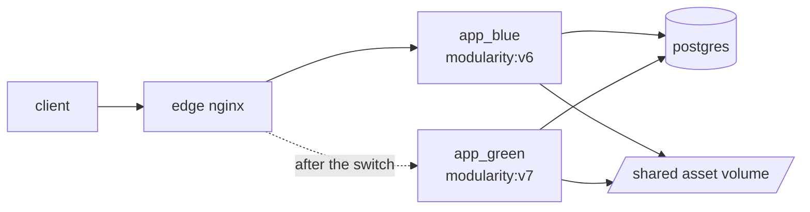

# Deployment

Blue-green on a single machine, with no cloud account required to try it.



Both colours exist at all times. The idle one is not spare capacity, it is the
rollback target: it keeps running the previous image, which is what turns a
rollback into a config reload rather than a rebuild.

## The rollout

```bash
./deploy.sh green --tag v7      # build, gate, switch
./deploy.sh --status            # which colour is live, on which image
./deploy.sh --rollback          # send traffic back to the idle colour
```

`deploy.sh` does seven things, in this order:

1. **Build** the target colour's image and tag it. `--no-build` skips this and
   deploys a tag built elsewhere, which is the normal shape in CI.
2. **Start** the idle colour on the new image. It is not in the load balancer,
   so nothing about this is visible to a client.
3. **Wait** until it reports ready. This runs `php artisan health:check` over
   an exec rather than probing HTTP, because at this moment the container is
   not reachable through the proxy. Same checks, no temporary route in.
4. **Migrate and sync the permission catalogue**, from the new colour.
   Deploying a module that declares new permissions has to project them into
   storage, or the module ships with capabilities nothing can grant. The sync
   is additive during a rollout for the same reason the migrations are: the
   colour still serving must keep working. Removing a permission that no
   module declares any more strips it from every role, so that half is a
   separate, deliberate `access:sync-permissions --prune`.

   Existing roles do **not** receive new permissions automatically. A
   capability that grants itself on deploy is a security hole, so somebody has
   to grant it. Safe only because migrations are
   expand-only: the colour still serving keeps working against the new schema.
   That constraint is what makes the rest of this possible, and it is why
   destructive changes are split across releases.
5. **Cache** config and routes on the new colour.
6. **Switch**: rewrite the one-line upstream file and `nginx -s reload`.
   Reload, not restart, so in-flight requests finish where they started. A
   smoke test follows immediately, and a failure points the arrow back.
7. **Drain** for a few seconds, then report.

Every step before 6 is undone by doing nothing. Step 6 is undone by step 6 in
reverse, which takes about a second because the old container never stopped.

## Rollback is a traffic switch, not a deploy

`--rollback` moves the arrow and touches nothing else. It deliberately does
not start or rebuild the idle colour: doing so would recreate that container
from whatever tag the compose file defaults to, quietly destroying the exact
thing being rolled back to. If the idle colour is not running, the script says
so and stops rather than inventing a replacement.

## Why the assets are shared

Each colour publishes its built assets into one volume the edge serves from.
Vite fingerprints every filename, so the two colours coexist there: a client
that loaded a page from the old colour keeps getting the old stylesheet while
the new one serves the new page. The copy is additive and nothing is deleted
during a rollout.

The entrypoint that performs the copy has no error suppression on purpose. A
container that cannot publish its assets serves pages without a stylesheet,
and failing to start is a far more useful way to discover that.

## The image

Three stages: assets, dependencies, runtime.

- Base images are pinned to exact versions. A floating tag makes the image you
  ship depend on the day you built it.
- The dependency stage installs, copies the source, then installs again. The
  second run is not redundant: it makes the stage correct by construction
  rather than by trusting `.dockerignore` to have kept a developer's
  dev-dependency vendor tree out of the build context. A `--no-dev` image that
  carries a dev-built `bootstrap/cache/packages.php` fails at boot looking for
  a provider it does not have.
- OPcache is compiled into the official PHP image already and is configured,
  not installed. Asking `docker-php-ext-install` for it a second time
  reconfigures the source tree and wipes the modules directory before the
  other extension is installed.
- `opcache.validate_timestamps=0`, because the code in an image never changes
  under it. A new release is a new container, not a reload in place.

## Connecting a database client

The database publishes `127.0.0.1:5432` only, so a client on this machine can
reach it and nothing on the network can. When 5432 is already taken:

```bash
DB_HOST_PORT=5433 docker compose up -d database
```

Credentials come from `.env`: database `modularity`, user `modularity`,
password `secret` by default.

## What this does not solve

A demonstration of blue-green is not a production deployment system, and the
gap is worth naming rather than leaving for someone to discover.

Not addressed here:

- **Queue workers.** There are none. A worker running the old image while the
  new one serves, and the versioning problem that creates for jobs already on
  the queue, is the largest omission.
- **Rollback after a destructive migration.** The expand-and-contract rule
  makes forward changes safe; it does not give you a way back from a `drop`.
- **Deployment locking.** Two concurrent runs of `deploy.sh` would race on the
  upstream file. One operator, one machine is assumed.
- **Secrets.** `.env` is a file on the host. No rotation, no vault, no
  per-colour secret versioning.
- **Sessions and cache** survive only because both colours share one database.
  A colour with a different session format would break sign-in mid-rollout.
- **Multi-region, warm-up, and gradual traffic shifting.** The switch is all
  or nothing.

Each of those is a real problem in a real system. This solves the part that
demonstrates the mechanism.

## Running it

```bash
cp .env.example .env
docker compose up -d
docker compose exec app_blue php artisan key:generate
docker compose exec app_blue php artisan migrate --seed
open http://localhost:8080
```

`docker compose up` does not migrate, and `deploy.sh` only migrates the colour
it is deploying, so a brand new database volume needs that one command. Until
it runs, both colours report `unhealthy` and `GET /api/health` names the
dependency that is not ready:

```json
{"data":{"status":"down","checks":[
  {"name":"database","status":"up"},
  {"name":"cache","status":"down","message":"..."}
]}}
```

That is the check doing its job. Migrations stay out of container startup on
purpose: a container that migrates on boot will happily run the same migration
from two colours at once.

Then try a rollout:

```bash
./deploy.sh green --tag v2
curl -s localhost:8080/api/health     # "colour": "green"
./deploy.sh --rollback
curl -s localhost:8080/api/health     # "colour": "blue"
```

The health endpoint reports which colour answered, so a rollout can be
confirmed from outside rather than inferred from a file on the host.
